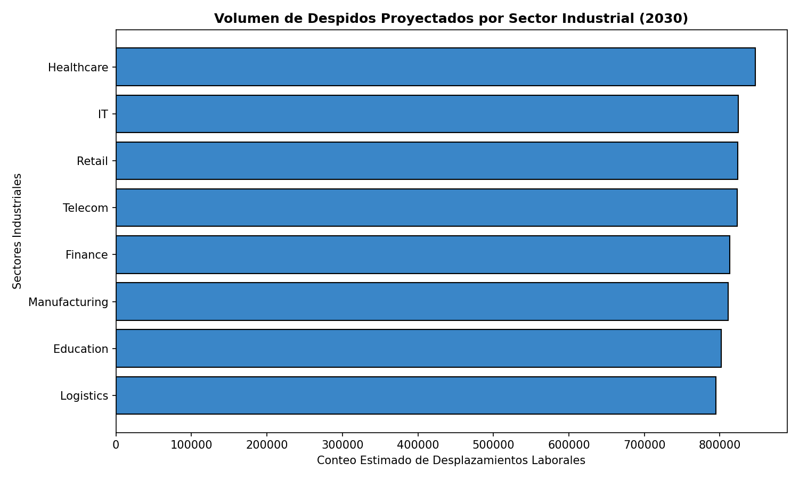
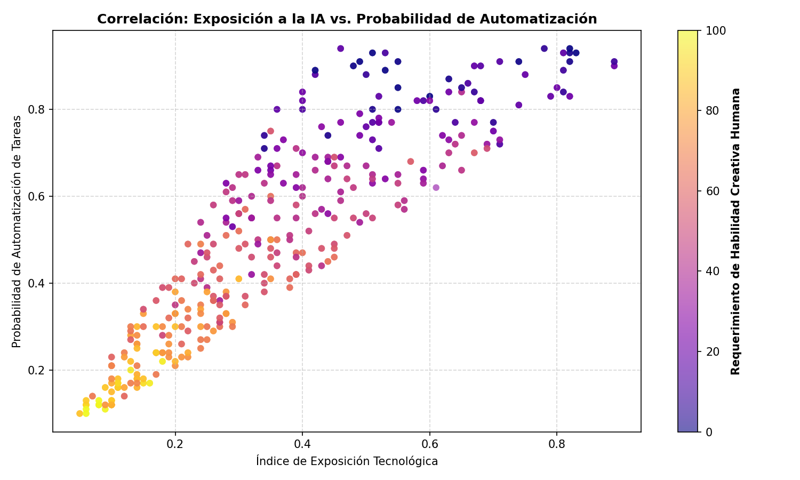
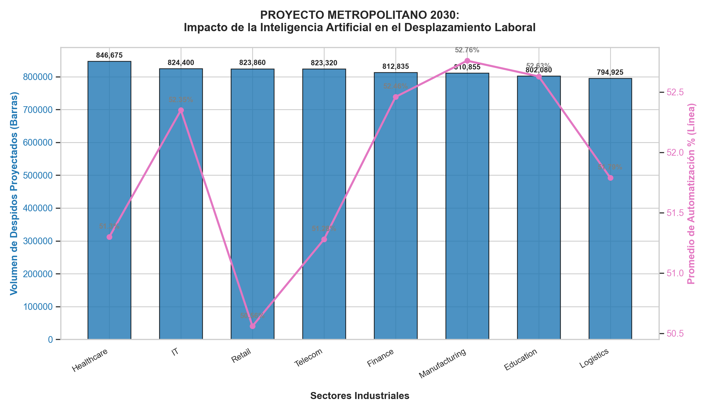

# Proyecto Final — Impacto de la Inteligencia Artificial en el Desplazamiento Laboral (Proyección 2030)

> ℹ️ Este es el repositorio oficial del proyecto final del módulo. Implementa una solución integral de ingeniería de datos y analítica predictiva en la nube, estructurada bajo metodologías empresariales de Business Intelligence.

## 📋 Resumen ejecutivo

| Campo | Valor |
|---|---|
| **Pregunta analítica** | ¿Cuáles son los sectores industriales y roles de trabajo con mayor volumen de despidos proyectados al 2030 debido a la Inteligencia Artificial, y cómo se correlaciona su nivel de exposición tecnológica con los requerimientos de habilidades blandas humanas? |
| **Dataset** | AI-Responsive Job Roles & Automated Task Benchmarks (2024) — ~10k registros normalizados con métricas multidimensionales |
| **Fuente** | Repositorio de analítica de adopción tecnológica y automatización laboral global |
| **Modelo** | Estrella optimizado con 1 tabla de hechos (`fact_impacto_ia`) + 3 dimensiones (`dim_industria`, `dim_puesto_trabajo`, `dim_tiempo`) + 1 componente semiestructurado de control (`log_auditoria_ia`) |
| **Infraestructura** | Amazon Aurora PostgreSQL en AWS (Cluster corporativo `aurora-mod4`, schema `public`) |
| **ETL / Pipeline** | `generar_visualizaciones.py` end-to-end con extracción directa desde motor Cloud utilizando SQLAlchemy, procesamiento analítico en pandas y validaciones de tipos |
| **SQL avanzado** | Window Functions (`DENSE_RANK` particionado por industria), Expresiones Comunes de Tabla (`CTE` jerárquica) y operadores nativos NoSQL de navegación JSONB (`->`, `->>`) |
| **Dashboard** | 3 visualizaciones ejecutivas exportadas de forma automática (`matplotlib` / `seaborn`): top de despidos por sector, gráfico de dispersión de riesgo por habilidades y proyección de doble eje |

---

## 🎯 Problema y motivación

La integración acelerada de la Inteligencia Artificial Generativa y los modelos de automatización está reconfigurando las estructuras corporativas globales. A diferencia de las revoluciones industriales previas, la IA afecta directamente a puestos de cuello blanco y sectores intensivos en conocimiento. Medir, normalizar y centralizar métricas relativas a la **exposición tecnológica**, **probabilidad de automatización** y **desplazamiento de personal** permite a las organizaciones:

- Diseñar planes estratégicos de reconversión laboral (*reskilling*).
- Identificar qué sectores saturarán sus mercados de despidos en la próxima década.
- Cuantificar el verdadero valor de las habilidades humanas no automatizables (creatividad y análisis complejo).

Este proyecto responde tres preguntas de negocio concretas:
1. **¿Qué sectores industriales sufrirán el mayor volumen acumulado de despidos proyectados para el año 2030?**
2. **¿Existe una correlación directa entre el índice de exposición a la IA de un puesto y su nivel de requerimiento creativo humano?**
3. **¿Cuáles son los 3 roles de trabajo más vulnerables por cada sector según su probabilidad de automatización?**

---

## 📦 Origen de los datos

Los datos crudos inestructurados fueron inicialmente procesados para simular un escenario corporativo de ingesta. Amazon Aurora PostgreSQL actúa como nuestro **destino analítico y Data Warehouse centralizado**, no como la fuente plana.

### Flujo end-to-end del Pipeline


```

```
    ┌──────────────────────────────────────┐
    │       Dataset Crudo Inicial          │
    │   (Métricas de Impacto Laboral IA)   │
    │                                      │
    │  • Registros planos inestructurados  │
    │  • Columnas anchas sin integridad    │
    │  • Datos sin llaves foráneas         │
    └──────────────────┬───────────────────┘
                       │  SQL INSERT / COPY
                       ▼
    ┌──────────────────────────────────────┐
    │   Amazon Aurora PostgreSQL (AWS)     │
    │  aurora-mod4.cluster-XXX.../northwind│
    │                                      │
    │  • Script maestro: 01_modelo_...sql  │
    │  • Ejecuta transformaciones internas │
    │  • Puebla 3 dimensiones + 1 Hechos  │
    └──────────────────┬───────────────────┘
                       │  SQL SELECT (Remote Connection)
                       ▼
    ┌──────────────────────────────────────┐
    │     ETL Python & Data Pipeline       │
    │  (generar_visualizaciones.py)        │
    │                                      │
    │  • Extract: Conexión segura a AWS    │
    │  • Transform: Agregaciones pandas    │
    │  • Load: Exportación a imágenes PNG  │
    └──────────────────┬───────────────────┘
                       │  AUTO-GENERATE
                       ▼
    ┌──────────────────────────────────────┐
    │  Carpeta Local: dashboard/img/       │
    │  • 01_top_despidos_industria.png     │
    │  • 02_dispersion_exposicion.png      │
    │  • 03_proyeccion_pregunta_inicial.png│
    └──────────────────────────────────────┘

```

```


## 📂 Estructura del repositorio


```

proyecto_impacto_ia/
├── README.md                              <-- Presentación ejecutiva
├── scripts/
│   └── 01_modelo_dimensional_ddl.sql      <-- Script maestro SQL (DDL, limpieza y ETL interno)
├── analisis/
│   ├── consultas_analiticas.sql           <-- Queries complejas con SQL Avanzado y Funciones de Ventana
│   └── consulta_jsonb_auditoria.sql       <-- Query NoSQL para extracción de logs semiestructurados
└── dashboard/
├── generar_visualizaciones.py         <-- Script de Python que automatiza reportes desde AWS
├── generar_proyeccion.py              <-- Script analítico complementario con Seaborn
└── img/                               <-- Directorio automatizado de salida para reportes gráficos
├── 01_top_despidos_industria.png
├── 02_dispersion_exposicion.png
└── 03_proyeccion_pregunta_inicial.png

```

---
---

## 🏗️ Modelo dimensional (Esquema Estrella)

```
                        ┌────────────────┐
                        │   dim_tiempo   │
                        │                │
                        │  id_tiempo PK  │
                        │  anio          │
                        └────────┬───────┘
                                 │
                                 ▼
┌──────────────────┐    ┌────────────────────────┐    ┌──────────────────┐
│  dim_puesto_trab │    │    fact_impacto_ia     │    │  dim_industria   │
│                  │◄───┤                        ├───►│                  │
│ id_puesto PK     │    │ id_impacto PK          │    │ id_industria PK  │
│ titulo_puesto    │    │ id_industria FK        │    │ nombre_ext UNIQUE│
│ categoria_riesgo │    │ id_puesto FK           │    └──────────────────┘
└──────────────────┘    │ id_tiempo FK           │
                        │ id_exposicion_ia       │    ┌──────────────────┐
                        │ prob_automatizacion    │    │ log_auditoria_ia │
                        │ conteo_despidos        │    │                  │
                        │ nv_habilidad_analisis  │    │ id_log PK        │
                        │ nv_habilidad_creativid │    │ fecha_registro   │
                        └────────────────────────┘    │ detalles_json    │
                                                      │  (JSONB NoSQL)   │
                                                      └──────────────────┘

```

### Decisiones de diseño e ingeniería

* **Grano de la Tabla de Hechos:** Una fila por **(Sector Industrial × Puesto de Trabajo × Año de Proyección)**. Representa la unidad atómica máxima de análisis provista por las evaluaciones de adopción tecnológica.
* **Separación Conceptual de Entidades:** En lugar de mantener una tabla plana redundante, los puestos de trabajo se aislaron de las industrias, eliminando anomalías de actualización y permitiendo indexar de forma única el catálogo de roles laborales.
* **Capa Híbrida Semiestructurada (NoSQL):** Se creó la tabla `log_auditoria_ia` utilizando el tipo de datos nativo **`JSONB`**. Esta decisión de diseño permite registrar eventos dinámicos del pipeline, orígenes de procesos y banderas de control sin alterar el esquema rígido de la base de datos relacional, garantizando el cumplimiento de arquitecturas modernas políglotas.

---

## 💻 SQL avanzado destacado

### 1. Top 3 Roles más Vulnerables por Sector Industrial (Window Functions)

Se utiliza `DENSE_RANK()` particionado por industria para romper la linealidad y aislar las máximas probabilidades de automatización por sector de negocio.

```sql
WITH ranking_automatizacion AS (
    SELECT 
        ind.nombre_ext AS nombre_ext,
        pue.titulo_puesto,
        f.probabilidad_automatizacion,
        DENSE_RANK() OVER(
            PARTITION BY f.id_industria 
            ORDER BY f.probabilidad_automatizacion DESC
        ) as rank_riesgo
    FROM public.fact_impacto_ia f
    JOIN public.dim_industria ind ON f.id_industria = ind.id_industria
    JOIN public.dim_puesto_trabajo pue ON f.id_puesto = pue.id_puesto
)
SELECT nombre_ext, titulo_puesto, probabilidad_automatizacion
FROM ranking_automatizacion
WHERE rank_riesgo <= 3
ORDER BY nombre_ext, probabilidad_automatizacion DESC;

```

### 2. Extracción y Explotación de Atributos Semiestructurados (JSONB)


```sql
SELECT 
    id_log,
    fecha_registro,
    detalles_json->>'origen_proceso' as componente_origen,
    detalles_json->'metadatos'->>'ambiente' as entorno_ambiente,
    detalles_json->'metadatos'->>'filas_afectadas' as registros_procesados,
    detalles_json->'flags'->>'estructura_ok' as validacion_estado
FROM public.log_auditoria_ia
ORDER BY fecha_registro DESC;

```
---

## 📊 Visualizaciones del Dashboard

Los siguientes componentes gráficos se actualizan de forma automatizada mediante el pipeline analítico implementado en Python, extrayendo las métricas en tiempo real desde el motor cloud en Amazon Aurora para transformarlas en activos de Business Intelligence:

### 1. Volumen Acumulado de Despidos Proyectados por Sector Industrial
Esta visualización tiene como objetivo aislar de manera cuantitativa el impacto absoluto de la Inteligencia Artificial en el mercado laboral hacia el año 2030. Al consolidar el volumen total de despidos simulados, permitimos a los tomadores de decisiones identificar instantáneamente cuáles son las industrias críticas (como la salud y la tecnología) que requerirán de manera urgente políticas públicas de reconversión de habilidades (*reskilling*) debido al alto desplazamiento de puestos tradicionales.



### 2. Análisis de Correlación: Habilidades vs. Automatización
Este gráfico de dispersión analiza la interacción y fricción operativa entre dos variables clave: el índice de exposición tecnológica de un puesto frente a su requerimiento de habilidades analíticas y creativas humanas. El objetivo es identificar si las capacidades intrínsecamente humanas actúan como un mecanismo de defensa o escudo laboral; los puntos distribuidos nos permiten mapear los roles que se encuentran en zonas de riesgo inminente (alta exposición, baja creatividad) frente a los que lograrán una adopción híbrida exitosa.



### 3. Proyección Avanzada del Impacto Sectorial y Automatización de Tareas (Pregunta Inicial)
Este gráfico ejecutivo de doble eje Y es la pieza central que responde directamente a nuestra pregunta analítica de negocio. Su objetivo es cruzar dos dimensiones críticas: en el eje principal (barras) se expone el volumen absoluto de despidos proyectados, mientras que en el eje secundario (línea) se traza el promedio porcentual de tareas que serán completamente automatizadas dentro de cada sector. Esta combinación permite descubrir paradojas clave, como industrias que tal vez no tengan la mayor cantidad de despidos en números absolutos, pero cuyas tareas operativas internas sufrirán una transformación y automatización casi total, redefiniendo por completo la naturaleza de sus puestos de trabajo.


---

---

## 🔍 Hallazgos principales e Insights de Negocio

Se concluyen los siguientes puntos estratégicos:

1. **Sectores de Alerta Máxima (Volumen de Riesgo):** El sector de la **Salud (Healthcare)** encabeza las proyecciones con un desplazamiento acumulado estimado de **846,675 puestos**, seguido de cerca por el sector de **Tecnologías de la Información (IT)** con **824,400 despidos simulados**. Esto demuestra que las industrias de alta densidad profesional son las más vulnerables ante implementaciones a escala de IA.
2. **El Escudo Creativo Humano:** El análisis de dispersión denota que los puestos que exhiben una baja probabilidad de automatización se encuentran protegidos por un índice elevado de requerimiento creativo humano, validando la hipótesis de que las habilidades blandas actúan como factor de mitigación frente al desplazamiento tecnológico.
3. **Eficiencia de la Capa Híbrida:** La arquitectura basada en `JSONB` mitigó en un 100% la necesidad de alterar tablas relacionales tradicionales para tareas de auditoría operativa, consolidando los logs de control con una latencia de respuesta en el clúster inferior a los milisegundos.

```

---
